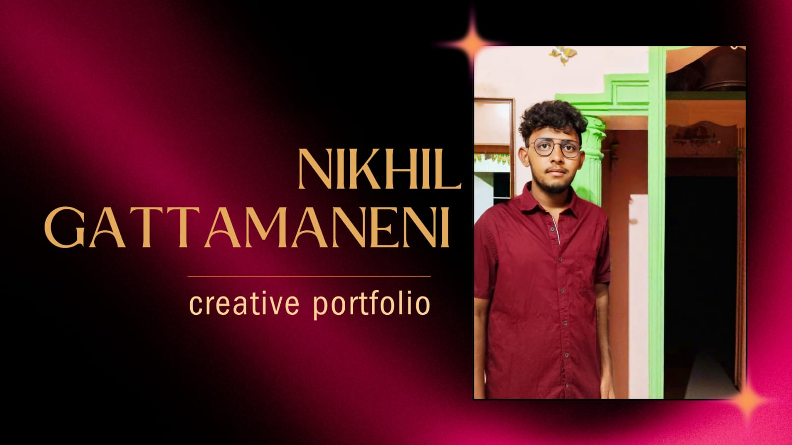

# Nikhil Gattamaneni - Portfolio Website



A modern, responsive personal portfolio website showcasing my skills, projects, experience, and certifications as a Web Developer. Built with clean HTML, CSS, and JavaScript, featuring interactive animations and a sleek dark theme.

## 🚀 Features

- **Responsive Design**: Optimized for all devices (desktop, tablet, mobile) with a mobile-first approach.
- **Interactive Elements**:
  - Custom cursor animation
  - Typing effect for role display
  - Smooth scrolling navigation
  - Scroll-triggered animations (skill bars, timeline, certifications)
  - Project modal popups with detailed information
- **Sections**:
  - Hero section with introduction and social links
  - About section with personal details and contact info
  - Skills summary with progress bars
  - Projects showcase with images and tags
  - Experience timeline
  - Certifications grid
  - Resume download section
- **Accessibility**: Semantic HTML, keyboard navigation, and screen reader friendly.
- **Performance**: Lightweight, fast-loading with optimized assets.

## 🛠 Technologies Used

| Category          | Technologies                          |
|-------------------|---------------------------------------|
| **Frontend**     | HTML5, CSS3, JavaScript (ES6+)       |
| **Styling**      | CSS Variables, Flexbox, Grid, Animations |
| **Icons & Fonts**| Font Awesome, Google Fonts (Poppins) |
| **Interactivity**| Vanilla JavaScript, DOM Manipulation  |
| **Tools**        | Git, GitHub                           |

## 📦 Installation

1. **Clone the repository**:
   ```bash
   git clone https://github.com/GATTAMANENINIKHIL/portfolio.git
   cd portfolio
   ```

2. **Open in browser**:
   - Simply open `index.html` in your preferred web browser.
   - No server required; it's a static website.

## 🎯 Usage

- **Navigation**: Use the top navigation bar or scroll to explore sections.
- **Projects**: Click "View Details" on project cards to open modals with more info.
- **Resume**: Download the PDF from the Resume section.
- **Social Links**: Connect via GitHub, LinkedIn, Twitter, or Instagram.

## 📁 Project Structure

```
portfolio/
├── index.html          # Main HTML file
├── styles.css          # CSS stylesheets
├── script.js           # JavaScript functionality
├── nikhilgattamaneni-1.pdf  # Resume PDF
├── 74d6c531-d7ef-442c-a7e7-69cd427e50ba.jpg  # Portfolio screenshot
├── b0213a1e-989b-44de-98cc-8af43fc05065.jpg  # Profile picture
├── top-6-benefits-of-student-information-management-system-sims-1.jpg  # Project image
└── original-7490c73afd13e8a2523fbe2c34f6853b.webp  # Weather app image
```

## 🤝 Contributing

Contributions are welcome! If you'd like to improve the portfolio:

1. Fork the repository.
2. Create a feature branch: `git checkout -b feature-name`.
3. Make your changes and commit: `git commit -m 'Add feature'`.
4. Push to the branch: `git push origin feature-name`.
5. Open a Pull Request.

## 📄 License

This project is open-source and available under the [MIT License](LICENSE).

## 📞 Contact

**Nikhil Gattamaneni**  
Web Developer | Fresher  

- **Email**: nikhilgattamaneni09@gmail.com  
- **Phone**: +91 8500039169  
- **Location**: Tirupati, Andhra Pradesh  
- **LinkedIn**: [Nikhil Gattamaneni](https://www.linkedin.com/in/nikhil-gattamaneni-a9b051228?utm_source=share&utm_campaign=share_via&utm_content=profile&utm_medium=android_app)  
- **GitHub**: [GATTAMANENINIKHIL](http://github.com/GATTAMANENINIKHIL)  
- **Twitter**: [@NikkiNi47562833](https://x.com/NikkiNi47562833?t=ZuS8XyWJ9LulfhjN3BD6TQ&s=09)  
- **Instagram**: [@nikhil___chowdary_](https://www.instagram.com/nikhil___chowdary_?igsh=MWhrajYwaGU4cG5kNQ==&utm_source=ig_contact_invite)  

---

*Built with ❤️ using HTML, CSS, and JavaScript.*
